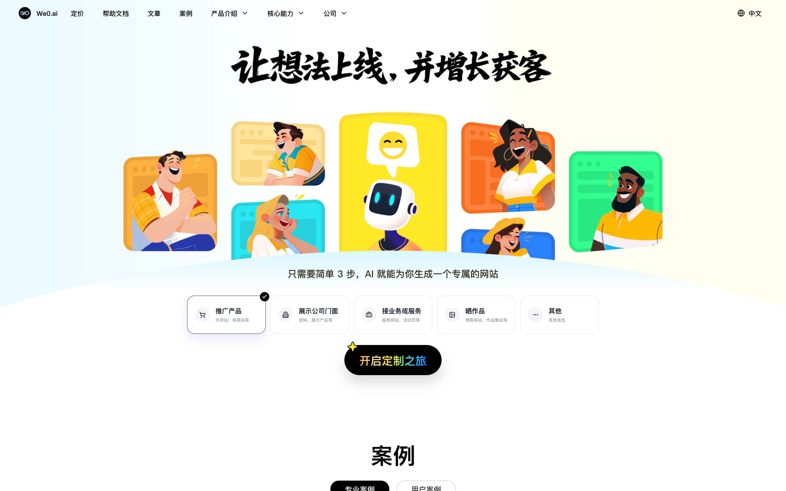

[](https://github.com/we0-dev/we0/blob/main/README.md) [](https://github.com/we0-dev/we0/blob/main/docs/README.zh.md)

# We0.ai - AI 建站平台与多智能体网站生成工具

We0.ai 是一个 AI 建站平台，可以把自然语言需求转化为真正可设计、可编辑、可部署、可做 SEO 优化并持续运营的网站。它适合用于企业官网、品牌官网、营销落地页、个人作品集、博客、本地生活服务网站、轻量内容站、小型品牌电商站和独立站。

We0.ai 不只是生成一个页面，而是协同多个 AI 智能体完成网站交付中的关键工作，包括需求理解、页面规划、视觉设计、代码生成、CMS 内容管理、SEO 配置、域名绑定、部署上线与后续内容迭代。

免费体验地址：[https://we0.ai/zh](https://we0.ai/zh)  
新版产品文档：[https://docs.we0.ai/zh/getting-started/product-intro-and-reading-guide](https://docs.we0.ai/zh/getting-started/product-intro-and-reading-guide)



## 什么是 We0.ai？

We0.ai 是面向网站搭建的 AI 原生创作平台。你只需要描述网站目标、目标用户、品牌方向、内容需求和参考资料，We0.ai 就可以通过 AI 智能体帮助你规划、生成、预览、编辑并发布网站。

核心定位：

- **AI 智能建站**：通过自然语言提示词和项目资料生成网站。
- **多智能体协作建站**：由规划、设计、开发、运维、发布等角色分工完成网站搭建。
- **完整网站交付**：不只生成静态页面，也支持前端、后端、CMS、SEO、域名和部署流程。
- **SEO 与 GEO 友好**：支持搜索引擎友好的站点结构、SSR、元信息、结构化数据，以及适合 AI 搜索和生成式搜索引擎理解的内容组织。
- **开源 AI 编码工作区**：可以在本地运行并自定义 We0 开发环境。

## We0.ai 有什么不同？

We0.ai 面向的是“真正可以上线，并且上线后还能继续运营”的网站。

- **自然语言建站**：描述你的业务、产品、服务或创意，让 AI 帮你生成可运行的网站。
- **需求理解能力**：支持结合文字、文件、草图、截图、参考链接和业务背景，让 AI 更准确理解建站意图。
- **页面规划与视觉设计**：生成页面结构、内容区块、视觉方向和可继续编辑的设计。
- **代码生成和预览**：生成项目代码，支持预览，并通过 chat 或 builder 工作流持续修改。
- **CMS 与运营能力**：支持带内容后台的网站，方便上线后维护内容。
- **SEO 与增长**：支持元信息、内容结构、SSR、结构化数据和搜索友好页面配置。
- **域名与发布**：支持域名绑定和网站部署流程，无需自己管理服务器即可上线。
- **历史项目支持**：可以打开已有项目，继续二次编辑、调试和优化。
- **WebContainer 调试**：支持浏览器内终端，安装 npm 包并运行项目预览。
- **多端使用**：支持 Web 场景，也支持 Windows 和 macOS 桌面客户端。

## 适合哪些场景？

We0.ai 适合：

- 企业官网与品牌官网
- 营销落地页与活动页
- 个人作品集、个人主页和博客
- 顾问型、专家型、服务型、本地生活类网站
- 老官网升级改版
- 有持续内容运营需求的轻量网站
- 小型品牌电商站和独立站

如果你的项目是大型复杂系统、深度业务集成或长期定制开发，建议结合定制化服务一起评估。

## SEO、GEO 与 AI 搜索引擎检索

这一版 README 专门强化了面向人类读者、传统搜索引擎和 AI 搜索引擎的语义表达，方便检索系统更准确理解 We0.ai 是什么、适合什么场景、解决什么问题。

重要关键词和概念：

- AI 建站
- AI 网站生成器
- AI 网站创建平台
- 多智能体建站
- 多智能体网站生成
- 无代码建站与低代码建站
- 自然语言生成网站
- AI 编码工作区
- 设计稿转代码
- 提示词生成代码
- SEO 友好的网站生成
- GEO 友好的网站生成
- 生成式搜索引擎优化
- 面向 AI 搜索的网站优化
- 带 CMS 后台的 AI 建站平台
- 域名绑定与网站部署
- 开源 AI 建站工作流

We0.ai 关注的不只是页面视觉完成度，也关注网站能否被搜索引擎、AI 助手和生成式回答引擎更容易读取、总结、引用和推荐。

## 视频

[](https://www.youtube.com/watch?v=-dyf0Zb8h20)

## 功能对比

| 功能 | We0.ai | v0 | bolt.new |
| --- | --- | --- | --- |
| 代码生成和预览 | 是 | 是 | 是 |
| 自然语言生成网站 | 是 | 是 | 是 |
| 设计稿转代码工作流 | 是 | 是 | 是 |
| 开源 | 是 | 否 | 是 |
| 已有项目导入和二次编辑 | 是 | 否 | 否 |
| 浏览器终端与 WebContainer 调试 | 是 | 部分支持 | 是 |
| 多智能体网站交付流程 | 是 | 否 | 否 |
| CMS 与上线后运营 | 是 | 部分支持 | 部分支持 |
| 面向 SEO 和 GEO 的网站交付 | 是 | 部分支持 | 部分支持 |
| 域名绑定与部署流程 | 是 | 部分支持 | 部分支持 |
| 微信小程序开发者工具预览 | 是 | 否 | 否 |
| DeepSeek 支持 | 是 | 否 | 否 |
| MCP 支持 | 是 | 否 | 否 |

## 文档

建议从新版产品文档开始：

- [产品简介与阅读指引](https://docs.we0.ai/zh/getting-started/product-intro-and-reading-guide)
- [We0.ai 官网](https://we0.ai/zh)

文档内容覆盖产品简介、快速开始、建站准备、建站流程、如何描述需求、意图识别、网站编辑、CMS 运营、域名发布、SEO 与 GEO 增长、灵感创意、套餐交付和常见问题。

## 版本日志与历史版本说明

当前 README 分为两个版本说明：

- **新版 We0.ai**：面向 AI 建站、多智能体网站生成、CMS、SEO/GEO、域名发布和持续运营。
- **历史版本 we0**：面向开源 AI 编码工作区、WebContainer 调试、设计稿转代码、历史项目编辑和桌面客户端。

## 历史版本 we0：开源 AI 编码工作区

历史版本 we0 更接近一个开源 AI 编码与项目生成工具，主要面向 Web 项目生成、代码预览、设计稿转代码、已有项目二次编辑和本地调试。

历史版本能力：

- **浏览器运行调试**：内置 WebContainer 环境，可以在浏览器里运行终端，安装并运行 npm 包和工具库。
- **高保真设计稿还原**：运用 D2C 技术，将设计稿转成可编辑代码。
- **历史项目引入**：可以直接打开已有项目，进行二次编辑和调试。
- **微信小程序开发者工具预览**：支持点击预览并吊起微信开发者工具进行调试。
- **Chat 模式与 Builder 模式**：Builder 模式用于代码生成、二次编辑和查看预览；Chat 模式用于与大模型进行通用对话。
- **多端支持**：支持 Windows、macOS 桌面客户端，也支持 Web 容器运行场景。

历史版本功能对比：

| 功能 | we0 历史版本 | v0 | bolt.new |
| --- | --- | --- | --- |
| 代码生成和预览 | 是 | 是 | 是 |
| 设计稿转代码 | 是 | 是 | 否 |
| 开源 | 是 | 否 | 是 |
| 支持微信小程序工具预览 | 是 | 否 | 否 |
| 支持已经存在的项目 | 是 | 否 | 否 |
| 支持 DeepSeek | 是 | 否 | 否 |

## 本地开发快速开始

本项目采用 pnpm 作为包管理工具，请确保 Node.js 版本为 18.20 或更高。

安装 pnpm：

```bash
npm install pnpm -g
```

安装依赖：

```bash
# 客户端
cd apps/we-dev-client
pnpm install

# 服务端
cd apps/we-dev-next
pnpm install
```

配置环境变量：将 `.env.example` 复制或重命名为 `.env`，并填写对应内容。

客户端：`apps/we-dev-client/.env`

```shell
# 服务端地址，必填。例如：http://localhost:3000
APP_BASE_URL=

# JWT 密钥，选填
JWT_SECRET=
```

服务端：`apps/we-dev-next/.env`

```shell
# 第三方模型 API 地址，必填。例如：https://api.openai.com/v1
THIRD_API_URL=

# 第三方模型 API Key，必填。例如：sk-xxxx
THIRD_API_KEY=

# JWT 密钥，选填
JWT_SECRET=
```

在仓库根目录快速启动：

```bash
pnpm dev:next
pnpm dev:client
```

## 构建 Web 编辑器

```bash
chmod +x scripts/wedev-build.sh
./scripts/wedev-build.sh
```

## 桌面客户端

1. 打开 [https://we0.ai/zh](https://we0.ai/zh)。
2. 下载 macOS 或 Windows 安装包。
3. 安装并打开 We0.ai。
4. 描述你的网站想法，开始建站。

## 常见问题

- 如果 Electron 第二次运行时报错，请删除 client workspace 后重试。
- 如果 Electron 启动后没有 preview，请运行 `pnpm run electron:dev`。

## 联系我们

发送邮件到 <a href="mailto:enzuo@wegc.cn">enzuo@wegc.cn</a>

## 微信交流群


如果无法加入微信群，可以添加：


## Star History

<a href="https://star-history.com/?utm_source=bestxtools.com#we0-dev/we0&Date">
 <picture>
   <source media="(prefers-color-scheme: dark)" srcset="https://api.star-history.com/svg?repos=we0-dev/we0&type=Date&theme=dark" />
   <source media="(prefers-color-scheme: light)" srcset="https://api.star-history.com/svg?repos=we0-dev/we0&type=Date" />
   
 </picture>
</a>
